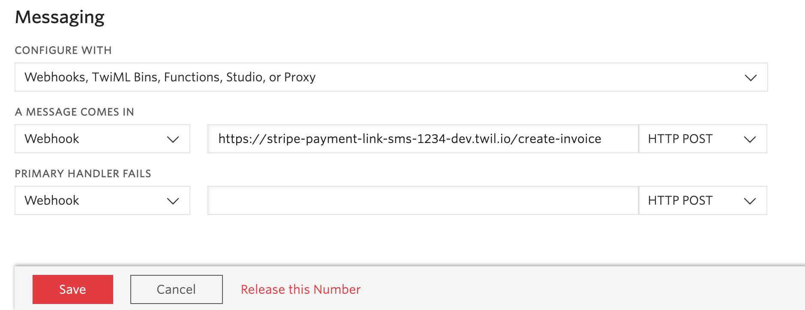
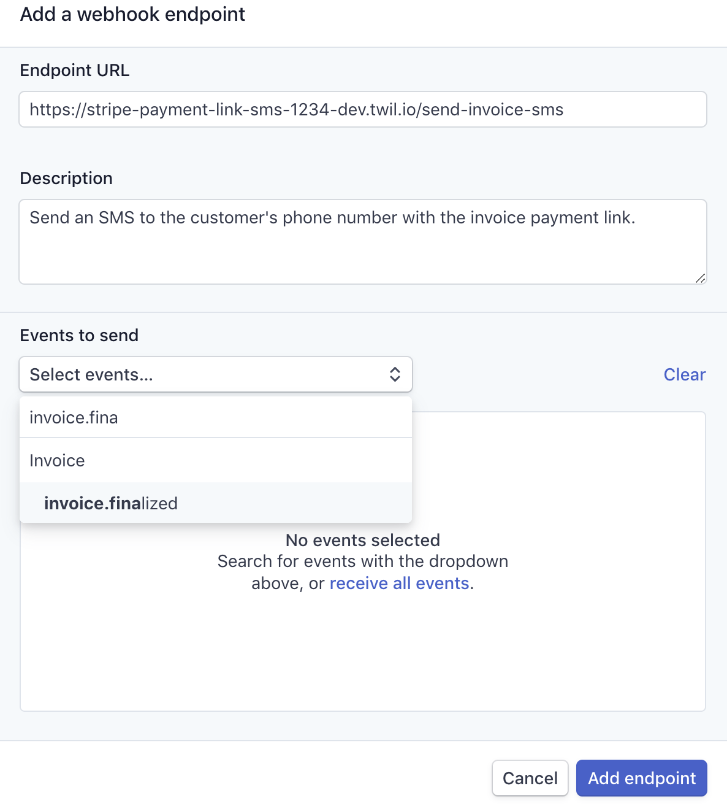

# Send Stripe Payment Link SMS

This template shows you how to create an invoice in Stripe based on an SMS prompt (in this case `DONATE <AMOUNT>`). Once the invoice is finalized, it will reply with a payment link.

It is divided up into two functions:

- [create-invoice](./functions/create-invoice.js): handles the Twilio webhook event when an SMS is received and creates the invoice in Stripe.
- [send-invoice-sms](./functions/create-invoice.js): handles the Stripe webhook event when the invoice is finalized and send the payment link SMS to the customer.


## How to use the template

The best way to use the Function templates is through the Twilio CLI as described below. If you'd like to use the template without the Twilio CLI, [check out our usage docs](../docs/USING_FUNCTIONS.md).

## Create a new project with this template

1. Install the [Twilio CLI](https://www.twilio.com/docs/twilio-cli/quickstart#install-twilio-cli)
2. Install the [Twilio Serverless Toolkit](https://www.twilio.com/docs/labs/serverless-toolkit/getting-started)

```shell
twilio plugins:install @twilio-labs/plugin-serverless
```

3. Initiate a new project

```
twilio serverless:init twilio-stripe-payment-link --template=stripe-payment-link-sms && cd twilio-stripe-payment-link
```

### Environment variables

This project requires some environment variables to be set. To keep your tokens and secrets secure, make sure to not commit the `.env` file in git. When setting up the project with `twilio serverless:init ...` the Twilio CLI will create a `.gitignore` file that excludes `.env` from the version history.

In your `.env` file, set the following values:

| Variable            | Meaning                                                                                | Required                     |
| :------------------ | :------------------------------------------------------------------------------------- | :--------------------------- |
| `ACCOUNT_SID`       | Find in the [console](https://www.twilio.com/console)                                  | Yes                          |
| `AUTH_TOKEN`        | Find in the [console](https://www.twilio.com/console)                                  | Yes                          |
| `STRIPE_SECRET_KEY` | Find in your [Stripe Dahsboard](https://dashboard.stripe.com/test/apikeys)             | Yes                          |
| `FROM_PHONE`        | Needs to be [configured](https://www.twilio.com/console/phone-numbers/getting-started) | Maybe (depending on country) |

## Deploying

To run your function on Twilio, you need to:

- Enable `ACCOUNT_SID` and `AUTH_TOKEN` in your [functions configuration](https://www.twilio.com/console/functions/configure).
- Add your `STRIPE_SECRET_KEY` to your [environment variables](https://www.twilio.com/console/functions/configure).
- Add `stripe` to your NPM package [dependencies](https://www.twilio.com/console/functions/configure). You can find the latest `stripe-node` version number on [GitHub](https://github.com/stripe/stripe-node/blob/master/VERSION).

Deploy your function with the [Twilio CLI](https://www.twilio.com/docs/twilio-cli/quickstart). Note: you must run this from inside your project folder.

```
twilio serverless:deploy
```

After successful deployment the Twilio CLI will output two function URLs along the lines of:

1. https://stripe-payment-link-sms-1234-dev.twil.io/create-invoice
2. https://stripe-payment-link-sms-1234-dev.twil.io/send-invoice-sms

Set (1) as the messaging webhook for your phone number in the Twilio console:



> Note: if you don't have an SMS enabled Twilio phone number yet, you will need to buy one in the [console](https://www.twilio.com/console/phone-numbers/getting-started).

Set (2) as the webhook URL in your [Stripe Dashboard](https://dashboard.stripe.com/webhooks) (Note: you need to set up test and live mode webhooks separately):



## Testing

### Scenario 1: Customer initiated (SMS)

Send `DONATE 10` to your SMS enabled Twilio phone number

### Scenario 2: Merchant initiated (Stripe Dashboard)

Create an invoice in the Stripe Dashbboard. Follow this [guide](https://stripe.com/docs/billing/invoices/create#without-code) or this [video](https://youtu.be/YftvRXupgpw). Make sure to set a phone number when entering the customer details.
